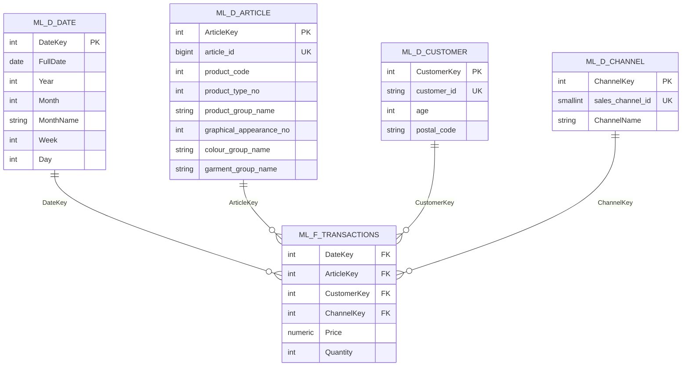

Modalytics
ETL + Data Warehouse + Power BI para explorar patrones de compra en la industria de la moda.

# ModaLytics

Pipeline de análisis de moda con dos caminos:
- **Cloud (PostgreSQL)** para demo online.
- **Local (DuckDB)** para reproducir sin servidores.

## Requisitos
```bash
pip install pandas pyarrow python-dotenv psycopg2-binary duckdb
```

## Datos
Coloca en `./data/sample/`:
- `transactions_sample_month=YYYY-MM.parquet` (varios)
- `articles_filtered.parquet`
- `customers_filtered.csv`

---

## Opción A — Cloud (PostgreSQL)
1. Copia `.env.example` a `.env` y completa credenciales (`DB_HOST, DB_PORT, DB_NAME, DB_USER, DB_PASS, SSL_MODE`).
2. (Opcional) Ejecuta DDL:
   ```bash
   psql "sslmode=require host=... user=... dbname=modalytics password=..." -f sql/ddl_postgres.sql
   ```
3. Carga dimensiones y hechos:
   ```bash
   python etl/load_postgres.py
   ```

## Opción B — Local (DuckDB)
Genera `modalytics.duckdb` con el modelo estrella y los datos del sample:
```bash
python etl/load_duckdb.py
```

---

## Diagrama del modelo (Mermaid)
> Diagrama tipo estrella: tabla de **hechos** conectada a **dimensiones**. GitHub renderiza Mermaid automáticamente.



---

## Power BI — Conexión, relaciones y medidas DAX

### Conexión
- **PostgreSQL**: Get Data → PostgreSQL → servidor/DB/usuario (usar SSL si tu proveedor lo requiere).
- **DuckDB**: Get Data → DuckDB (o usar el conector) → seleccionar `modalytics.duckdb`.

### Relaciones (modelo)
- `F_Transactions[DateKey]` → `D_Date[DateKey]` (**1:* activa**)
- `F_Transactions[ArticleKey]` → `D_Article[ArticleKey]` (**1:* activa**)
- `F_Transactions[CustomerKey]` → `D_Customer[CustomerKey]` (**1:* activa**)
- `F_Transactions[ChannelKey]` → `D_Channel[ChannelKey]` (**1:* activa**)

**Sugerencias:**
- Marcar **D_Date** como *Date table* (Modeling → Mark as date table → `FullDate`).
- Cross-filter: **single** desde dimensiones → hechos.
- Evitar columnas calculadas pesadas; preferir **medidas**.

### Medidas DAX base
```DAX
Total Sales = SUM(ml_f_transactions[Price])

Units = SUM(ml_f_transactions[Quantity])

Avg Price = DIVIDE([Total Sales], [Units])

Customers = DISTINCTCOUNT(ml_d_customer[CustomerKey])

-- Ventas año anterior
Sales YoY = CALCULATE(
    [Total Sales],
    DATEADD(ml_d_date[FullDate], -1, YEAR)
)

-- Nuevos vs Retornantes (aprox. mensual)
New Customers = 
VAR CurrMonth = MAX(ml_d_date[Month])
VAR CurrYear  = MAX(ml_d_date[Year])
VAR FirstMonthCustomer =
    CALCULATE(
        MIN(ml_d_date[Month]),
        ALLEXCEPT(ml_d_customer, ml_d_customer[CustomerKey])
    )
RETURN
    CALCULATE([Customers], FirstMonthCustomer = CurrMonth)

Returning Customers = [Customers] - [New Customers]

Retention % = DIVIDE([Returning Customers], [Customers])
```

> Ajusta la lógica de *New/Returning* según tu granularidad (mes/año). Para cohortes más exactas, crear una tabla auxiliar de **primer compra** por cliente y mes.

### Páginas sugeridas (dashboard)
1. **Overview**: Total Sales, Units, Avg Price, tendencia mensual y YoY.
2. **Productos**: Top categorías/colores/garment group, matrices por temporada.
3. **Clientes & Cohortes**: distribución de edad, nuevos vs retornantes, cohortes por mes de primera compra.
4. **Canales & Calendario**: share Store vs Online, estacionalidad.

---

## Estructura del repo
```
/data/sample        # archivos del sampler
/etl                # scripts de carga (PostgreSQL / DuckDB)
/sql                # DDL
/powerbi            # PBIX (próximamente)
/docs               # capturas / PDFs
```

## Notas
- No subas credenciales: usa `.env` (ejemplo en `.env.example`).
- Los scripts están listos para correr con tu sample generado (mar-sep 2020 por defecto).
- Puedes adaptar el rango de fechas en los scripts si tu sample es distinto.


Nota sobre el muestreo de datos

Este proyecto utiliza un subconjunto del dataset original de H&M, recortado al período marzo–septiembre 2020.
El muestreo permite:

Reducir el volumen total para un manejo ágil y reproducible.

Mantener suficiente variedad de productos, clientes y canales para un análisis representativo.

Facilitar la carga en servicios gratuitos de base de datos en la nube.

⚠️ Para preguntas de largo plazo o estacionalidad anual completa, sería necesario procesar el histórico completo.